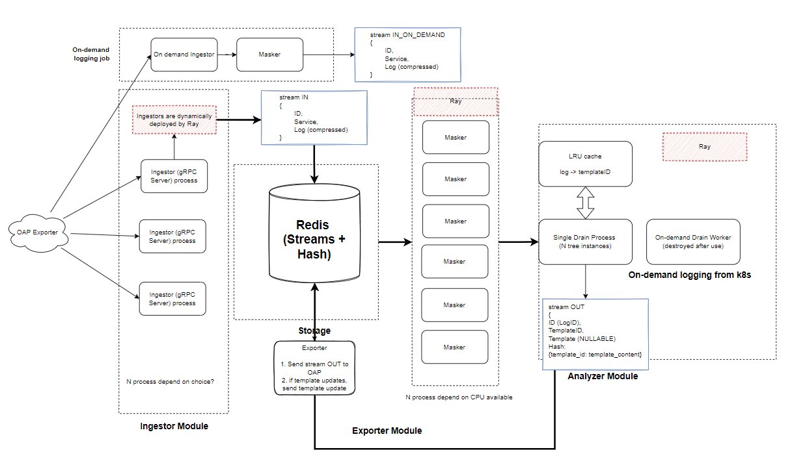
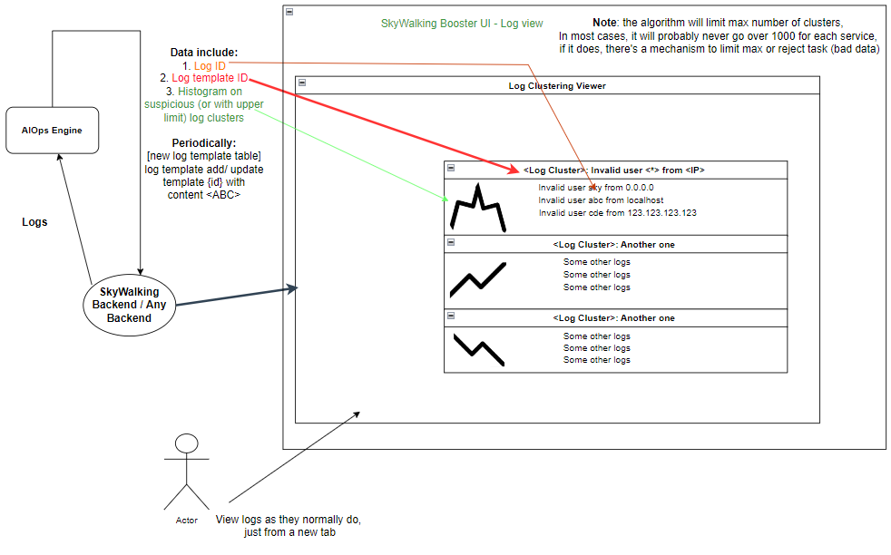

# SkyWalking AIOps Engine

*A practical open-source AIOps engine for the
era of cloud computing.*

## Why do we build this project?

**We strongly believe that this project will bring value
to AIOps practitioners and researchers.**

  
Towards better Observability

We could reason this from the following progressive questions:

1. Are there existing algorithms for telemetry data?
   - **Abundant.**

2. Are the existing algorithms empirically verified?

   - **Most algorithms are not verified in production**

3. Are there practical AIOps frameworks?
   - **Limited, often out of maintenance or commercialized.**

4. Are there open-source AIOps solutions that offers Out-of-Box integrations?
   - **Hardly any.**

5. Why would I need that?
   1. For developers & organizations curious for AIOps:
      - a. Just install and start using it, saves budget, prevents head-scratching.
      - b. Treat this project as a good (or bad) reference for your own AIOps pipeline.
   2. For researchers in the AIOps domain:
      - a. For software engineering researchers - sample for AIOps evolution and empirical study.
      - b. For algorithm researchers - playground for new algorithms, solid case studies.

Click the above section to find out where we place the value of this project,
though our current aim is to become the official AIOps engine
of [Apache SkyWalking](https://github.com/apache/skywalking),
each component could be easily swapped, extended and scaled to fit your own needs.

### Current Goal

At the current stage, it targets at Logs and Metrics analysis,
in the future, we will also explore root cause analysis and
automatic problem recovery based on Traces.

This is also the repository for
OSPP 2022 and GSOC 2022 student research outcomes.

1. `Exploration of Advanced Metrics Anomaly Detection & Alerts with Machine Learning in Apache SkyWalking`

2. `Log Outlier Detection in Apache SkyWalking`

### Architecture

**Log Clustering and Log Trend Analysis**

**Metric Anomaly Detection and Visualizations**

TBD - Soon to be added

### Roadmap

For the details of our progress, please refer to our project dashboard
[Here](https://github.com/SkyAPM/aiops-engine-for-skywalking/projects?query=is%3Aopen).

Phase Current (fall -> end of 2022)

0. [ ] Finish POC stage and start implementing dashboards for first stage users. (demo purposes)
1. [ ] Real-world data testing and chaos engineering benchmark experiments.
2. [ ] Join Apache Software Foundation as an Apache SkyWalking subproject.
3. [ ] Integrate with SkyWalking Backend (Export analytics results to SkyWalking)
4. [ ] Propose and request SkyWalking UI-side changes.
5. [ ] First release for SkyWalking end-user testing.

Phase Next

1.[ ] Towards production-ready.
